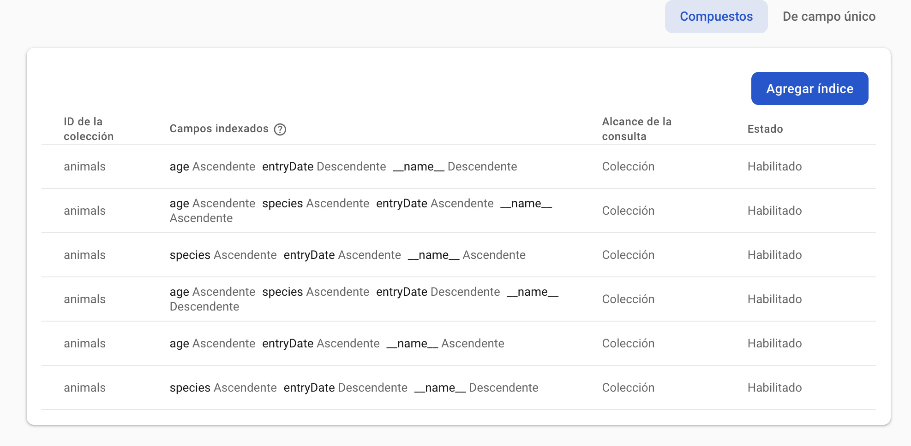
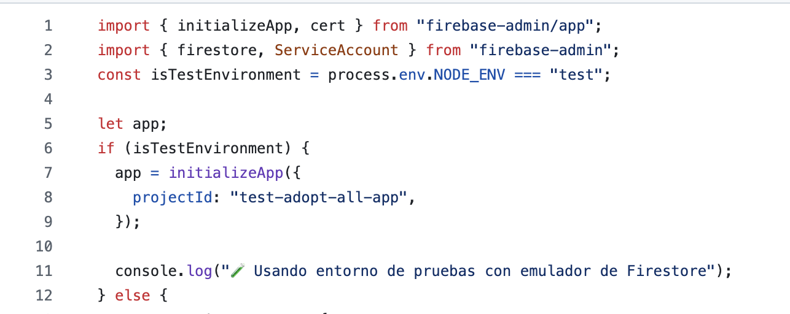

# Technical Notes

## Why I'm building this app with Expo?
In 2024 React Native published an article that recommended the use of a framework to build React Native Apps. Using a framework like Expo is now the recommended approach when creatng new apps. Currently, the only recommended community-driven framework for RN is Expo. lso, Expo is open source and has very useful services like EAS (Expo Application Services) that allow you to build, deploy and manage apps. I've been using Expo for two years now and I'm very pleased with it's capabilities. 

## Exploring Hexagonal Architecture in Frontend

I've been studying hexagonal architecture for just a few months. Previously, my approach to project structuring followed the traditional folder organization model [show example]. However, as I delved deeper into hexagonal architecture for my backend (since my current work focuses more on backend), an interesting question arose: how to apply these concepts to a frontend?

I realized that many principles of hexagonal architecture can be transferred to the frontend, with some adjustments. In this project, one of the first challenges was choosing Expo Router (more details on this later), which established a key limitation: each file within /app had to represent a route. Additionally, Expo documentation recommended placing components in a folder called /components.

My first approach was, therefore, to separate the following folders:
* /app
* /components
* /modules

Within /modules, my initial idea was that there should be nothing related to React Native components. But as I progressed, I realized that the logic of hooks didn't fit in /components either, since they aren't simply visual elements like Card or List.

Looking for a more coherent structure, I decided to organize /modules into layers following this model:
* Domain
* Application
* Infrastructure
* Presentation

Here, the Presentation layer would act as the place to locate the module-specific UI components, maintaining the principles of separation of responsibilities.
One of the points I struggled most with was the location of hooks. Being at an intermediate point between the internal logic of the application and interaction with external services, I finally decided to place them in Infrastructure. I still have doubts about whether this was the best decision, but what I do find useful is that now I can enter the Presentation layer and not find hook logic or contexts mixed with components.
I'm aware that, for a project of this scale, this structure may seem over-engineered. However, my intention was to demonstrate the potential of this approach. If the project were to grow, this organization would allow for greater scalability and maintainability.

## Routing

**Why did I choose Expo Router?** I've chosen this option mainly because I'm more familiar with React Navigation and I've experienced the struggle to implement deep linking, while in Expo Router it's a built-in feature. At the end, Expo Router is built over React Navigation, so it's truly native and platform-optimized, as they explain in their documentation. Also, I just felt curious about it and I wanted to try it, since I've already developed with Next.js and I'm familiar with the file-based routing system.

### Main Files
* **app/_layout.tsx**: This file defines the main layout of the application, where global providers such as UserProvider and ThemeProviderWrapper are configured. Additionally, it uses SafeAreaView to ensure content is displayed correctly on different devices. Within this file, the Slot component from Expo Router acts as a container for nested routes, allowing child screens to render correctly.
* **app/index.tsx**: This file functions as the root route of the application. When loaded, it automatically redirects the user to the /explore route using the Redirect component from Expo Router.

### Tab System
The application implements a **tab navigation system** organized within the app/(tabs)/ folder:
* **app/(tabs)/_layout.tsx**: This file configures tab navigation using the Tabs component from Expo Router. It defines three main tabs:
    * **Explore**: Allows users to discover animals available for adoption.
    * **My applications**: Manages adoption applications submitted by the user.
    * **Settings**: Allows configuring application preferences.

### Nested Routes
Each tab contains specific nested routes:
* **Explore**:
    * **index.tsx**: Displays the list of animals available for adoption.
    * **[id].tsx**: Shows the details of a specific animal, using a dynamic route based on the animal's id.
    * **modal.tsx**: Presents a modal that allows users to filter available animals according to various criteria.
* **Applications**:
    * **index.tsx**: Displays the list of adoption applications submitted by the user.
    * **[id].tsx**: Shows the details of a specific application, using a dynamic route based on the application's id.
    * **create.tsx**: Presents a form to create a new adoption application.
* **Settings**:
    * **index.tsx**: Contains the general configuration of the application, allowing users to modify their preferences.

### Important Note on Routes
When the user selects an item in the list view, imported in the **index.tsx** page of each main route (for example, an animal available for adoption), the data of the selected item is passed as props to the detail view route **[id].tsx**. This means that the animal's details, such as its name, description, and photos, are passed directly to the next view, eliminating the need to make a new request to obtain the same information.
This decision was made to optimize the application's performance, as the data of animals put up for adoption does not change frequently. By avoiding a new API query, the user experience is improved by making navigation between views faster and more efficient. This approach also helps reduce the load on the backend, as it is not necessary to make a new request for each transition between views. However, in the future, if it were decided that some data may change more frequently, a mechanism for updating or verifying the data could be implemented when necessary.

## Modules

### Animal Module

The only use case here is **findAnimals**, which executes a GET with a query to obtain a list of animals based on different parameters. The API that receives this call is responsible for reading the parameters and making the query to Firestore, which, being indexed, is quite fast. I indexed all possible searches.

 

At this point, the query calls all animals without limit or pagination, something that clearly would need to be improved. I would have liked to add more complex queries, for example, filtering by whether an animal is sterilized or not was an idea at the beginning, but I preferred to keep it simple due to time constraints.

Regarding the animal domain, two interfaces were defined: Animal and AnimalWithDistance. Animal, by itself, is stored with its geographical location (lat,lon), but then it needs to be extended when calculating the distance between the animal and the user. 

In the infraestructure section, we have a hook that is responsible for making the call to the database to obtain the list of animals. It uses both the filter hook and the location hook to make decisions. 

First, it uses the filter hook to build the query, which I actually believe that could be refactored. Once the query is ready, the animals are stored in a state. The fetch is executed every time there is a change in what it receives from the filter hook. 

The next step is that, if the user's location exists and a list of animals has already been obtained, then it calculates the distances and generates a new list of animals with their calculated distances so that the animal list in the presentation layer can consume it. 

**Several questions arise here**. The first is whether it would have been better to handle the distance calculation in the backend and return a single list to the front. There's also the issue of returning a list of animals even if we couldn't get the user's location, for example. I feel that this hook could have been simplified with more time to reflect, especially because it is interacting with the filter and location states at the same time. Something that concerns me is the speed with which animal data is obtained. The query is fast, but the fact of having to iterate over each of the animals to calculate its distance puts it in a linear complexity that, in a way, nullifies the benefit of Firestore indexing. Perhaps the key is to combine Firestore's fast indexing with pagination and calculate distance only for the first 30 or 40 results, which would be much more efficient and would allow calculating distances as more data is loaded.

Also, **it would have been ideal to order animals by their distance from the user, as it is probably one of the most important criteria for users when searching for an animal to adopt**. But since, for now, distance is a calculated value in the client side, it would be impossible to order by it in the query in Firestore. That's why I decided to order the animals by the time they were registered in the database for adoption.

### Location Module

It was one of the first modules I worked on, if not the first. The Location entity consists of a latitude and a longitude, like the one stored by each of the animals in their documents. But once I extract this location from the user's device, I found it useful to add a timestamp to know when that location was actually calculated, so I decided to create a LocationWithTimestamp interface that extended this first entity. In the future, I would like to expand this timestamp idea to track the user's position, taking into account the optimization of phone resources and ensuring that it only updates every so often, but always providing feedback on when the calculation was performed.

Almost at the end of development, I thought it wouldn't cost me much to transform this data into more understandable information for the user, using reverse geocoding, so I created PlaceInfo and LocationWithPlace, which extend the location with more data if available. The main use cases are:

- calculating the distance between the user and the animal
- obtaining the user's location

For the latter, I implemented a hook (useLocation) using Expo Location, while for distance calculations I used Geolib. I could have directly used the Haversine algorithm instead of installing a library, but it seemed unnecessary to complicate it when Geolib already solved it efficiently. Regarding Expo Location, i made sure not to forget to ask for the permissions that must be requested from the mobile user, and also to specific ACCESS_FINE_LOCATION in Android that allows to obtain the user's location with a higher precision.

**Why did I choose Expo Location?** I'm not familiar with geolocalization services, so I did a bit of research. I saw that Geolocation API in React Native is deprecated, and that they in their own documentation recommend using @react-native-community/geolocation. I decided to go with Expo Location, since time constraints were tight and I couldnt afford to spend more time researching the nuances of each library available. Considering that the code is decoupled from the Expo Location library, it would be easy to replace it with another library if needed. 

### Applications Module

In the Adoption Applications module, I realized late that the name "applications" for adoption applications clashed with the name of the application layer of the architecture, but at that point, it wasn't worth changing it. As for the domain entity, storing fullName and email wasn't really necessary, as that data could be obtained directly from the UserContext. However, when I set it up, I didn't plan to implement a UserContext. That's the reason for this situation.

Regarding use cases, there are four main ones to cover the CRUD: get all applications by user, create, edit, and delete. I created three hooks: one to get the applications, another to handle creation and updating, and a last one for deletion. In retrospect, I could have organized them differently. A single hook would have been an option, or at least integrating delete within useApplicationForm. The hooks are mainly responsible for managing state, controlling communication processes with the API, and propagating states (loading, error, success) to other components.

### Settings Module
The Settings module is greatly simplified. I haven't implemented any logic except for the Dark/Light mode adjustment. It uses a custom card component, which represents each type of available setting. This component accepts a title and an icon as props, which are defined according to the type of setting. The idea was to create a very flexible component that allows its use in different settings cases, simply by varying the title and icon. Additionally, the logic of the onPress event is open, which means it can be customized depending on what you want to achieve with each setting. For example, in the case of the light/dark mode setting, the component allows switching between light and dark modes with a click, but this behavior could be easily modified for other configurations in the future.

### User Module
When I started working on the Settings module, my initial idea was to take advantage of it to show an example of useContext implementation specifically for handling the change between light and dark mode, as it seemed like a simple and manageable approach. However, I found that useTheme already existed and that React Navigation provided a provider to manage this aspect, which allowed me to take advantage of it and focus on customizing my themes without having to reinvent the wheel.  But then I completely forgot my initial intention of showing the implementation of state management with useContext. When I realized I had left that aspect pending, I quickly worked on a simple context to handle user information. Due to time constraints, I decided to hardcode the id of a user I had created, so that user-related requests would always use that fixed id. While this worked for my tests and the limited time I had, I am aware that, in the long term, the ideal would be to send the user's identity through headers as an authentication token, which the backend can then properly validate and authorize.

### Shared Module

The shared module is a fundamental part of the project, as it centralizes common functionalities that are used by other modules. A key aspect of this module is the abstraction of HTTP calls, which I implemented using Axios. I decided to use Axios because I find the native fetch API to be somewhat cumbersome to use, and Axios provides a more intuitive and straightforward approach to making HTTP requests.

I implemented a pattern to create and configure the data repository for animals and applications. Specifically, it defines a BuildRepository class that initializes an HTTP client based on Axios and injects it into a concrete implementation of the specified repository. The file exports repository, which is an instance created immediately upon importing the module, providing centralized access to the animal repository methods. This implementation follows the principles of clean architecture and dependency injection, where the infrastructure layer provides concrete implementations of the interfaces defined in the domain layer, allowing the use cases of the application layer to access data (of animals, applications) from the backend API without directly depending on specific implementations. I still need to refactor this Build Repository, which has been duplicated in the applications and animals modules.

## Styles and Design
I have implemented a custom design system deliberately dispensing with component libraries like React Native Paper. Although in retrospect these libraries would have allowed me to focus more on logic, I opted to develop my own style system to demonstrate my ability to create interfaces without relying on external solutions.
The styles are based on these three premises:
1. **Custom theme system**: Extending the native themes of React Navigation (DefaultTheme and DarkTheme), I have created CustomLightTheme and CustomDarkTheme that maintain compatibility with navigation while adding custom properties such as primary and container colors.
2. **Design tokens**: Inspired by systems like Tailwind CSS, I have defined scalable tokens for: spacing, typography, border radius,... These tokens follow the principle of multiples of 8 to maintain visual consistency, with a minimum spacing of 16px between containers and screen edges.
3. **Reusable components**: I have developed custom components that encapsulate common styles and behaviors, such as Text, Button, TextInput,... and other utility components like Spacing, LineBreak, Loading, etc...

The technical implementation is based on StyleSheet from React Native combined with the useTheme hook from React Navigation to dynamically access the values of the current theme. This allows the application to automatically respond to changes between light and dark mode of the system. The ThemeProviderWrapper acts as a central point for theme management, detecting the user's preference through useColorScheme() and applying the corresponding theme to the entire application. The current location of components in modules/shared/custom works well, although the name "custom" could be refined to something more descriptive. Still, the advantage of keeping them in the "shared" module is clear, as it ensures their accessibility from any part of the application.

## Testing
Regarding testing, I opted for Jest as the testing tool. I've chosen Jest because it's the default testing tool for React Native and it's well integrated with the React Native ecosystem. 

I decided to pick one specific case to focus on the CRUD of applications, as it was the case that involved more diverse interactions with the database beyond a GET.

The unit tests focused on checking the logic of the CRUD functions, ensuring that everything worked correctly at the application layer level. These tests allowed verifying that the functions for creating, reading, updating, and deleting applications responded according to expectations. Then, I implemented an integration test that verified how the functions interact with the API and with the Firestore database, ensuring that the complete flow of data from the application layer to the database was coherent.

Although the tests are currently configured to point to the published API, it would be more appropriate to configure them to point to localhost. This would allow running the tests with the local backend, which I have specifically configured to have a test environment that emulates a fake database in Firestore.  I opted for this configuration to save time and avoid those testing the app having to also start the backend during tests, but it's clear that changing the URLs to avoid pointing to the production environment would really be ideal.

I would have liked to implement behavior tests of the components and end-to-end tests to verify the complete flow of the application, from user interaction with the interface to the database. This would provide even more complete coverage and help ensure that the application works correctly in a real production environment.

## Areas for Improvement

### TypeScript Typing
In the AnimalList component, I had to resort to @ts-ignore to suppress compiler errors. This represents a technical debt that should be addressed to ensure the integrity of the type system and truly take advantage of TypeScript's benefits.

### Design System and Assets
* I have consciously limited work on image optimization or the inclusion of animations to prioritize business logic aspects. However, I have incorporated specific details such as customization of navigation icons to improve the user experience.
* I have detected unwanted behavior in the filter component, where the filter icon shifts vertically when opening the filter panel. This visual bug affects the perception of interface quality and should be corrected.

### Re-rendering
The current implementation causes some unnecesary re-rendering on the Application List after coming back from checking an application detail. I addressed this problem in the Explore screen, but had not time to implement the same solution in the Application List.
### Responsive Design
The current responsive design strategy is primarily based on avoiding fixed widths, which provides basic adaptability to different screen sizes. [show examples on different devices] However:
* The design requires additional work to properly adapt to devices such as iPad and other tablets, where the current distribution does not efficiently take advantage of the available space.
* I have identified specific problems in TextInput components on iOS. This indicates the need to implement platform-specific adjustments.

### Data Validation
The current implementation of data validation presents important limitations:
* Validations are implemented directly in the useApplicationForm hook, which violates the single responsibility principle and makes reuse difficult.
* Only basic fields (email and full name) are validated with quite simplified rules.
* The validation logic should be extracted to an independent module that can be imported where needed.

### Error Handling
Error handling represents one of the most critical areas for improvement. Its implementation is quite basic. It would be necessary to be able to capture and categorize errors to give users more useful messages about what has happened in the system, in addition to helping the system better handle states.

Thank you so much for taking your time reading this document. This was actually a very enjoyable challenge!
